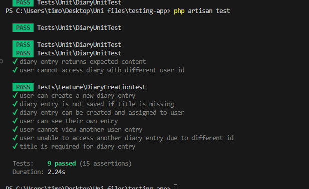

Test plan
User story 1
As a user I want to create new diary entries with a title and content, so that I can reflect on my daily thoughts and experiences.
Happy path
Given the user is logged in, when they fill in the diary form page with a title and content, then the diary entry is saved to the database and they are redirected to the index page.
Unhappy path
Given the user submits a form with an empty title form field, then the system doesn’t save the new entry.

System tests cover the following:
Diary entry is assigned to a user if logged in and new diary entry is created
Diary entry is not saved to the database if the title field is missing.

Unit test covers the following:
Verifies that a entry can be created and assigned to a user 

User story 2
As a user, I want to view the full content of a specific diary entry, so that I can reflect on what I’ve written in the past.

Happy path
Given the user is logged in and is on the /diary index page, when they click on a diary entry title from their entries, then they are shown the full title and content of that diary entry.

Unhappy path
Given the user tries to access a diary entry that doesn’t belong to them or that doesn’t exist, then they are shown a 403 or 404 page.

System tests cover the following:
User can go to /diary/{id} and read their own diary entry
Users are redirected and shown the 403 error if they attempt to access a diary entry that belongs to another user.
Unit test covers the following:
Users are unable to access another diary entry from another user because the id of the user (author) is different to logged in user

Applying the V-Model

User story 1:
As a user I want to create new diary entries with a title and content, so that I can reflect on my daily thoughts and experiences.

Requirements design: 
A logged-in user needs to be able to create diary entries with title and content
System design:
At /diary/create (protected page), there needs to be a form displayed with a title and entry field, as well as a ‘Submit’ button that makes a request to the backend and redirects the user back to /diary (index) upon success.
Architectural design
Client-side validation: the title should have a ‘required’ attribute that prevents form submission with an empty title field. 
Server-side validation: when the request is received, the title field should be validated (marked as required using the validator) and return an error if it’s missing, or continue to create the entry and then returning a 200 response
Module design
DiaryController (store method) will handle logic for saving the diary entry
Form validation will occur client-side and server-side (DiaryController)
User id is obtained from Auth::id() and added to validated object (validated[‘user_id’] = Auth::id())
Diary model is used to create the new row 
Index blade view is shown to the user with the new row in the list of entries
Unit test:
Verifies that a new diary entry can be inserted into database when user is logged in
System testing
Verifies that the diary entry is assigned to the correct user (not null) when a new row is inserted, as well as preventing submission if the title field is not provided.

User story 2:
As a user, I want to view the full content of a specific diary entry, so that I can reflect on what I’ve written in the past.

Requirements design: 
A logged-in user needs to be able to view all of their own entries in 1 place so that they can click any of them and view the full content of it (show page)
System design:
At /diary (index) it needs to list all the diary entries that belong only to the logged in user.
Architectural design
Client-side: user will need to log in view /login 
Server-side validation: when the initial request to /diary is made, the backend will check which user is currently logged in, and depending on that return the associated entry rows
Module design
AuthController will allow the user to either register or log in
DiaryController will retrieve all the entries associated with the users id
Blade view will then loop over all the entries and list them on the page with links so the show page so the user can click them and view the entire entry.
Unit test:
User id does not match the id of another user, so that in the DiaryController, it wont fetch the entry from another user since the id is different
System testing
Users are redirected to a 403 (forbidden page) when attempting to access another diary by id (via the url instead of the index page)

Test results:

Evaluation

Describe a possible mistake/error that can be detected by your test(s)
If the DiaryController didn’t first check for the user id before retrieving the provided entry, then a user could provide any ID and if that ID exists then it would show it to them even if the user is either not logged in at all, or the entry isn’t associated with their user id.

Describe a possible mistake/error that can not be detected by your test(s)
My tests do not test for a 404 not found, so if they provide an ID that doesn’t exist, my tests do not verify that the user is correctly served with the 4040 page, instead they might be thrown an error.

To what extent can you conclude that "everything works correctly"? Provide arguments!
The main functionality/purpose of this app was to allow users to authenticate themselves and then store diary entries. The app allows all the users to create a user (done in all the tests), and it also allows them to create entries. To avoid users from seeing other peoples entries, I am also checking that the associated id matches the user_id. As a bonus, since the ID is not user provided it is also not vulnerable to SQL injection attacks. In conclusion, as the main functionality is implemented and pass the tests “everything works as expected”.

